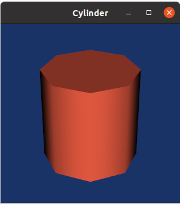

# pointcloudviewer

## Introduction
This repo is use 3D graphics technique like opengl, osg, vtk for 3D point cloud viewer

project contain some demo and study notes

Wellcome to star and fork to contribute

## How to build 
```
cd pointcloudviewer

./build.sh
```
## Find help
```
./build.sh -h
```
```
Usage
    build.sh [options]

Options
    --clean                                                 
    --clean-all       = Clean all tmp files before building.

Example
    ./build.sh --clean
```

### qtdemo
The QTdemo is a QT window to show point cloud

The test .pcap file can download form: https://data.kitware.com/#collection/5b7f46f98d777f06857cb206/folder/5b7f47568d777f06857cb208


### pclrecognitiondemo
This demo aims at explaining how to perform 3D Object 
Recognition based on the pcl_recognition module.

The source code can ref:

https://pcl.readthedocs.io/en/latest/correspondence_grouping.html

### tools
This folder is a library to read point cloud from .pcd file.

### osgdemo
This demo is a osg viewer to show point cloud.


### vtkdemo
This demo use vtk to rendering a Cylinder model.



### opengldemo & opengldemo1 & openglstudy
This folder contain opengl demo to show point and study demo.

### qtopengltexture
qt opengl texture demo


Thanks to jaredtao's repo https://github.com/jaredtao/QtOpenGL

### qtopengl_flashlight
flashlight demo


### qtopengl_mulitlight
mulitlight demo


### resources
This folder contain some point cloud file (.pcd) for some demo to load.
